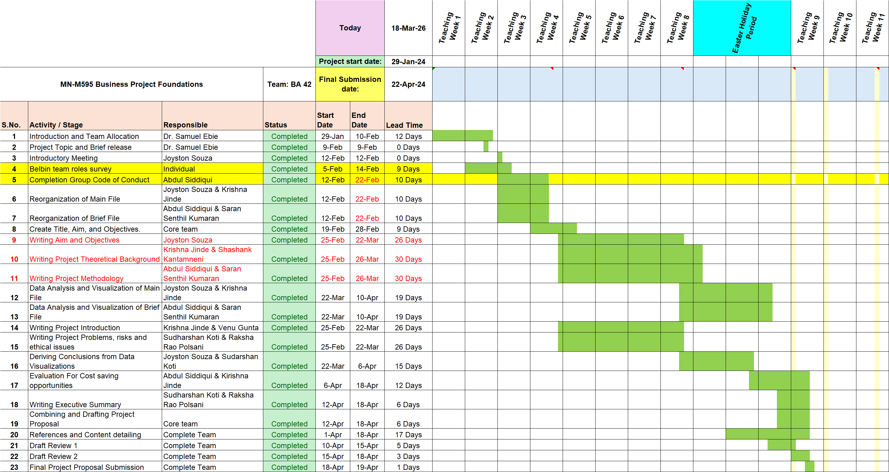

# Energy Consumption Data Analysis for NHS  
### A Tool for Cost Saving (Group Project)

---

## 📌 Project Overview
This group project focuses on analyzing energy consumption data within NHS facilities in Swansea to identify cost-saving opportunities and improve efficiency.

Hospitals consume large amounts of energy, leading to high operational costs and environmental impact. This project transforms raw data into meaningful insights to support better decision-making.

---

## 🎯 Objectives
- Clean and organize energy data  
- Analyze energy usage patterns  
- Identify inefficiencies  
- Recommend cost-saving solutions  

---

## 🧠 Methodology (Six Sigma - DMAIC)

- Define: Identify energy-related problems  
- Measure: Collect and prepare data  
- Analyze: Identify trends and inefficiencies  
- Improve: Suggest optimization strategies  
- Control: Ensure long-term improvements  

---

## 📁 Project Files

### 📊 Data
- [Dataset](data/nhs-energy-dataset.xls)

### 📄 Reports
- [Final Report](reports/nhs-energy-analysis-report.pdf)

### 📽 Presentation
- [Slides](presentation/nhs-energy-presentation.pptx)  
- Video Presentation: ([(https://swanseauniversity-my.sharepoint.com/:v:/r/personal/2378726_swansea_ac_uk/Documents/Swansea%20Modules/Business%20Project/Done/BA%2013%20MN-D019%20Project%20Presentation%20Video.mp4?csf=1&web=1&nav=eyJyZWZlcnJhbEluZm8iOnsicmVmZXJyYWxBcHAiOiJPbmVEcml2ZUZvckJ1c2luZXNzIiwicmVmZXJyYWxBcHBQbGF0Zm9ybSI6IldlYiIsInJlZmVycmFsTW9kZSI6InZpZXciLCJyZWZlcnJhbFZpZXciOiJNeUZpbGVzTGlua0NvcHkifX0&e=J1dxpp)])

### 📂 Supporting Documents
- [Project Structure](Supporting_Documents/docs/project-structure.docx)  
- [Group Code of Conduct](docs/group-code-of-conduct.pdf)

---

## 📅 Project Timeline

The Gantt chart represents task allocation and project scheduling.

---

## 👥 Team Contributions

- Raksha – Executive Summary  
- Krishna – Introduction & Business Problem  
- Sudharshan – Background Research  
- Saran – Methodology & Desk Research  
- Joyston – Findings & Analysis  
- Abdul – Recommendations  
- Shashank – Conclusion  
- Team – References  

---

## 🔍 Key Insights
- Identified high energy consumption areas  
- Found inefficient usage patterns  
- Highlighted opportunities for cost reduction  

---

## 💡 Recommendations
- Improve energy monitoring  
- Optimize energy usage  
- Implement energy-efficient strategies  

---

## 📌 Conclusion
This project provides a structured and data-driven approach to reducing energy costs and improving sustainability in NHS facilities.

---
